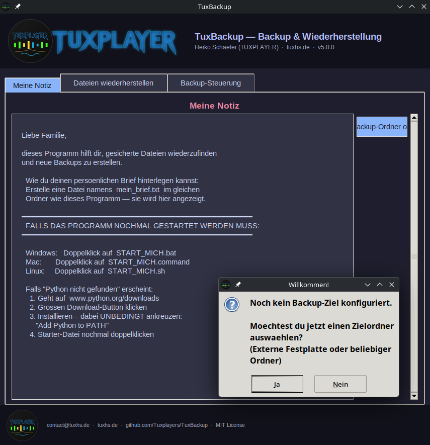
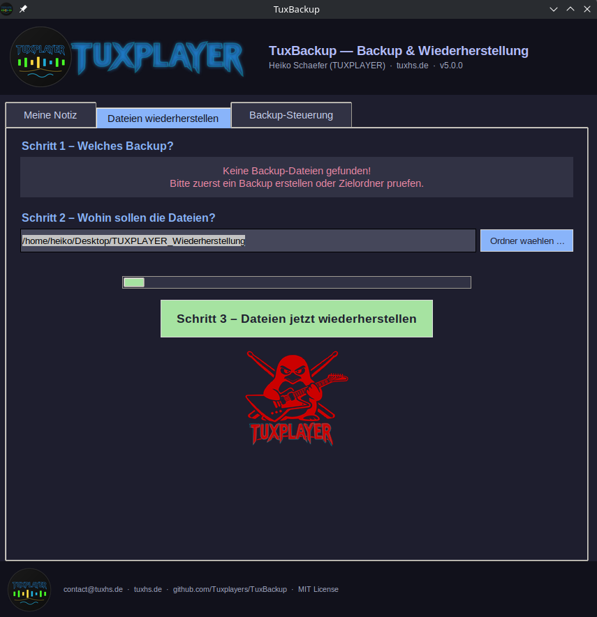
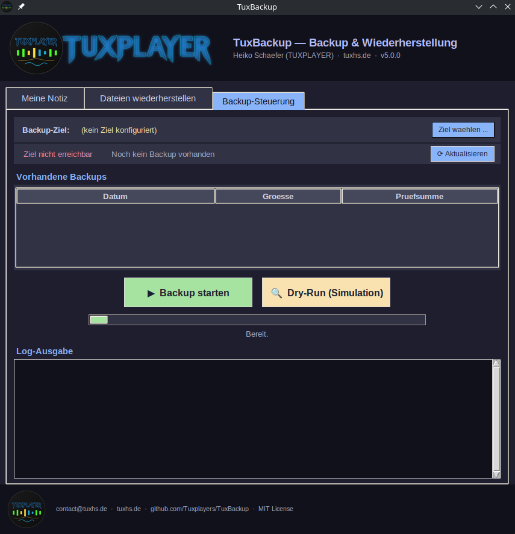

# TuxBackup

> **Plattformübergreifendes Backup- und Wiederherstellungs-Tool mit grafischer Oberfläche.**
> Läuft auf Linux, Windows und macOS — ohne Installation zusätzlicher Pakete.

---

<div align="center">

**Entwickelt von Heiko Schaefer · TUXPLAYER**

[](https://tuxhs.de)
[](https://github.com/Tuxplayers)
[](https://www.patreon.com/c/u19664883)
[](LICENSE)
[](https://python.org)

</div>

---

## Screenshots

| Meine Notiz | Dateien wiederherstellen | Backup-Steuerung |
|:-----------:|:------------------------:|:----------------:|
|  |  |  |

---

## Was kann TuxBackup?

- **Vollständiges Home-Backup** als komprimiertes `.tar.gz`-Archiv
- **SHA256-Prüfsumme** wird während des Backups berechnet — kein zweiter Durchlauf nötig
- **Grafische Oberfläche** (tkinter) — keine zusätzlichen Pakete erforderlich
- **Frei wählbares Zielverzeichnis** — externe Festplatte, NAS oder beliebiger Ordner
- **Dateien wiederherstellen** direkt aus der GUI
- **Dry-Run Modus** — vollständige Simulation ohne Schreibzugriff
- **Automatisches Platzmanagement** — maximal 3 Backups, ältestes wird automatisch gelöscht
- **Suspend-Schutz** (Linux/systemd) — verhindert Schlafmodus während des Backups
- **Persönliche Notiz** — hinterlege einen Brief in `mein_brief.txt`, er wird im Programm angezeigt

---

## Schnellstart

### Windows
```
Doppelklick auf START_MICH.bat
```

### macOS
```
Doppelklick auf START_MICH.command
```

### Linux
```bash
bash START_MICH.sh
# oder direkt:
python3 tuxplayer_backup_gui.py
```

> **Python wird benötigt** — kostenlos unter [python.org/downloads](https://www.python.org/downloads/)
> Bei der Installation unbedingt **"Add Python to PATH"** ankreuzen (Windows).

---

## Erste Schritte

1. Programm starten (siehe Schnellstart oben)
2. Tab **"Backup-Steuerung"** öffnen
3. **"Ziel wählen ..."** klicken — externe Festplatte oder Ordner auswählen
4. **"▶ Backup starten"** klicken — fertig

Die Einstellung wird dauerhaft in `tux_config.json` gespeichert.

---

## Voraussetzungen

| Komponente | Pflicht | Hinweis |
|---|:---:|---|
| Python 3.8+ | ✅ | Auf Mac/Linux oft vorinstalliert |
| tkinter | ✅ | In Python enthalten |
| tar | ✅ | Auf Linux/Mac vorhanden; Windows: via WSL oder Git Bash |
| systemd-inhibit | ❌ | Optional — Suspend-Schutz auf Linux |
| Pillow (PIL) | ❌ | Optional — verbesserte Bilddarstellung |

---

## Persönliche Notiz (optional)

Erstelle eine Datei namens `mein_brief.txt` im gleichen Ordner wie das Programm.
Sie wird im Tab **"Meine Notiz"** angezeigt — ideal als hinterlegter Brief für Familienmitglieder.

---

## Engine direkt nutzen (Kommandozeile)

```bash
# Backup mit konfiguriertem Ziel
python3 tuxplayer_backup_engine.py

# Backup mit eigenem Zielverzeichnis
python3 tuxplayer_backup_engine.py --target /mnt/meine-festplatte/backup

# Dry-Run — Simulation, nichts wird geschrieben
python3 tuxplayer_backup_engine.py --dry-run

# Eigene Quelle und Ziel angeben
python3 tuxplayer_backup_engine.py --source /home/nutzer --target /mnt/backup
```

---

## Projektstruktur

```
tuxplayer_backup_gui.py      ← Grafische Oberfläche (Hauptprogramm)
tuxplayer_backup_engine.py   ← Backup-Engine (wird von GUI aufgerufen)
START_MICH.bat               ← Starter für Windows
START_MICH.command           ← Starter für macOS
START_MICH.sh                ← Starter für Linux
tux_config.json              ← Einstellungen (wird automatisch erstellt)
mein_brief.txt               ← Persönliche Notiz (optional, selbst erstellen)
LICENSE                      ← MIT Lizenz
```

---

## Unterstütze das Projekt

TuxBackup ist kostenlos und quelloffen.
Wenn dir das Projekt gefällt und du die Weiterentwicklung unterstützen möchtest:

👉 **[Unterstütze mich auf Patreon](https://www.patreon.com/c/u19664883)**

Ich freue mich auch über einen ⭐ Stern auf GitHub!

---

## Über den Autor

**Heiko Schaefer** — Musiker, Programmierer und Linux-Enthusiast aus Kirchentellinsfurt / Tübingen.

Als TUXPLAYER veröffentliche ich Musik und Open-Source-Projekte.

- 🌐 Website: [tuxhs.de](https://tuxhs.de)
- 💻 GitHub: [github.com/Tuxplayers](https://github.com/Tuxplayers)
- 🎵 Patreon: [patreon.com/c/u19664883](https://www.patreon.com/c/u19664883)
- ✉️ Kontakt: [contact@tuxhs.de](mailto:contact@tuxhs.de)

---

## Entwicklung & Transparenz

Dieses Projekt wurde von Heiko Schaefer konzipiert, entwickelt und getestet.
Bei der Implementierung wurde [Claude Code (Anthropic)](https://claude.ai/code) als KI-Assistent eingesetzt.
Alle Entscheidungen, Tests und Veröffentlichungen liegen beim Autor.

---

## Rechtliche Hinweise

### Lizenz

TuxBackup steht unter der **MIT Lizenz** — siehe [LICENSE](LICENSE).
Du darfst das Programm frei nutzen, verändern und weitergeben, solange der Copyright-Hinweis erhalten bleibt.

### Haftungsausschluss

TuxBackup wird **ohne jegliche Gewährleistung** bereitgestellt.
Der Autor übernimmt keine Haftung für Datenverlust oder Schäden, die durch die Nutzung entstehen.
**Wichtig:** Überprüfe deine Backups regelmäßig. Ein Backup ist kein Ersatz für mehrere unabhängige Sicherungskopien.

### Datenschutz

TuxBackup speichert **keine persönlichen Daten** und sendet **keine Daten ins Internet**.
Die einzige gespeicherte Datei ist `tux_config.json` mit dem gewählten Backup-Zielverzeichnis — lokal auf deinem Rechner.

### KI-generierter Code

Teile des Quellcodes wurden mit Unterstützung von KI-Werkzeugen erstellt.
Der gesamte Code wurde vom Autor geprüft, getestet und verantwortet.
Gemäß den Empfehlungen des EU AI Acts wird der Einsatz von KI-Werkzeugen hiermit transparent offengelegt.

---

## Changelog

### v5.0.0 (2026-03-26) — Erste öffentliche Version
- Backup-Ziel frei wählbar (kein hardcodierter Pfad mehr)
- Einstellungen werden in `tux_config.json` gespeichert
- Erststart-Dialog zur Ziel-Konfiguration
- Tab "Meine Notiz" liest aus `mein_brief.txt`
- MIT Lizenz
- Vollständige README mit Rechtlichem und Links

### v4.0.4 (2026-03-25) — Private Vorgängerversion
- SHA256 on-the-fly (kein zweiter Durchlauf)
- Dry-Run Modus
- GUI als Einzeldatei (alles eingebettet)

---

*© 2026 Heiko Schaefer (TUXPLAYER) · [tuxhs.de](https://tuxhs.de) · MIT License*
